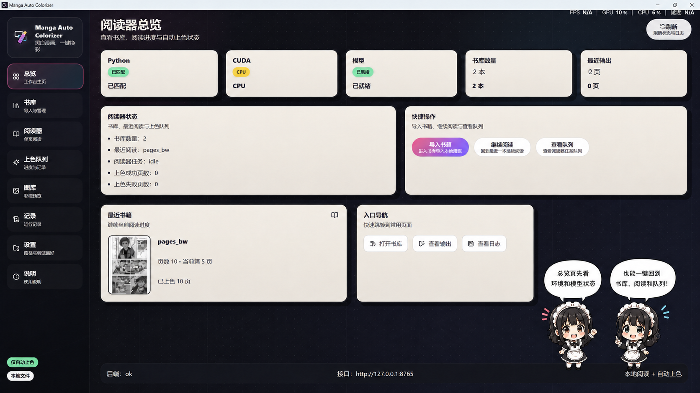
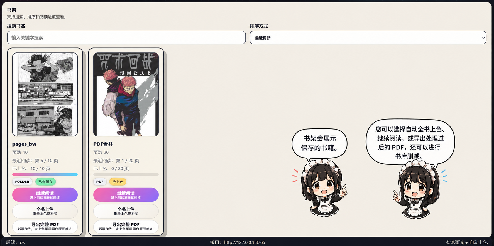
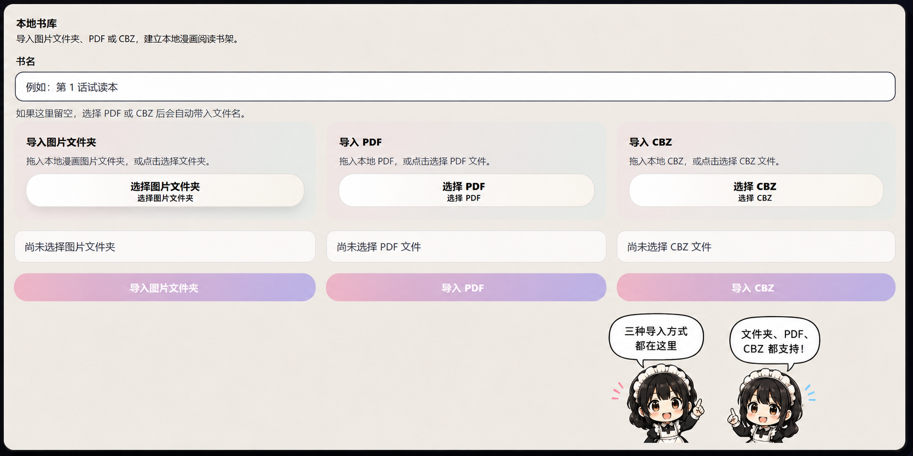
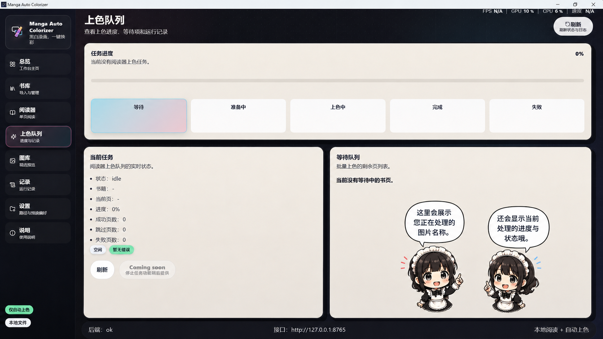
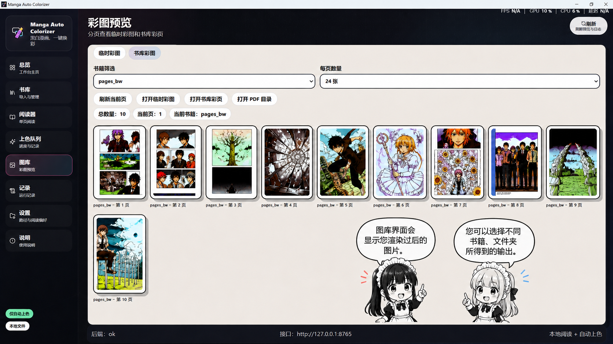
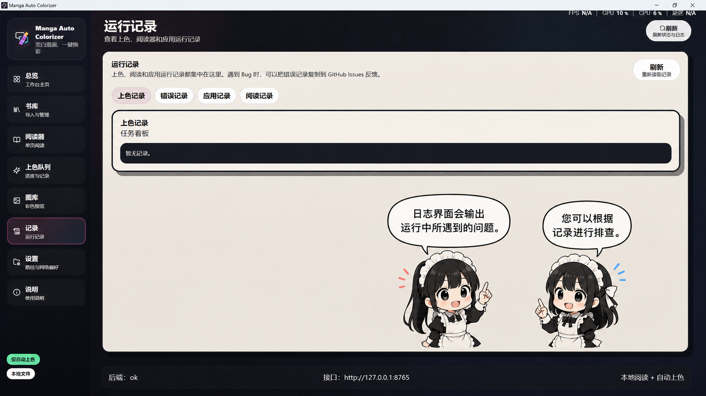
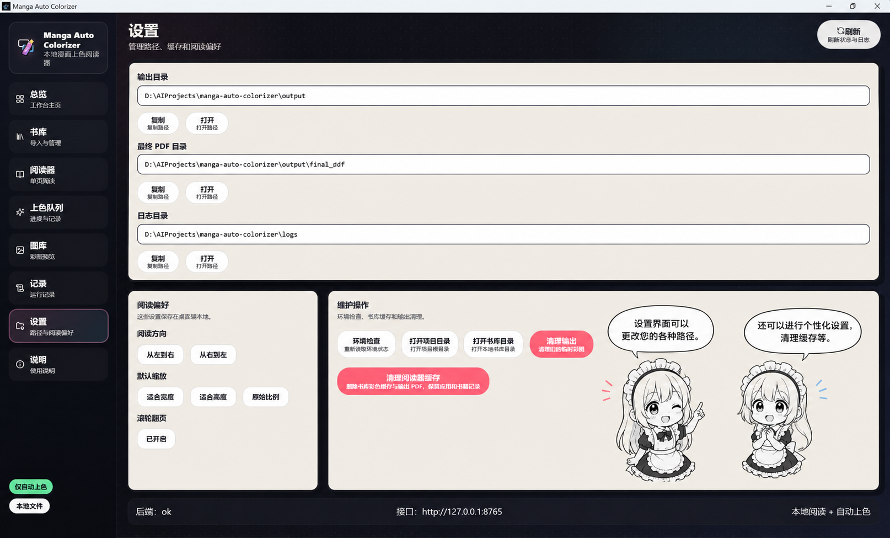

# Manga Auto Colorizer & Reader

Windows 本地漫画阅读与自动上色工具。导入本地漫画后，可以在阅读器里按页查看黑白原图和彩色结果，并导出完整 PDF。

> 当前仅做好 1.0 免费开源初代产品，2.0 会基于真实用户反馈继续开发。

## 效果对比

<table>
  <tr>
    <td align="center"><strong>Before</strong><br></td>
    <td align="center"><strong>After</strong><br></td>
  </tr>
</table>

仅用于展示自动上色前后效果。

## 应用界面展示

下面是 Manga Auto Colorizer 1.0 的主要界面，按日常使用顺序展示。

### 1. 阅读器总览

查看本机环境、模型状态、书库数量、最近阅读和常用入口。

<p align="center">
  
</p>

### 2. 书架

展示已保存的书籍，可继续阅读、全书上色、导出处理后的 PDF，也支持书库删减。

<p align="center">
  
</p>

### 3. 本地书库导入

支持导入图片文件夹、PDF 或 CBZ，并建立本地漫画阅读书架。

<p align="center">
  
</p>

### 4. 上色队列

查看当前处理图片、上色进度、任务状态和等待队列。

<p align="center">
  
</p>

### 5. 彩图预览

分页查看渲染后的彩图输出，并按书籍、文件夹切换不同输出结果。

<p align="center">
  
</p>

### 6. 运行记录

集中查看上色、阅读器和应用运行记录，方便定位问题和反馈 Bug。

<p align="center">
  
</p>

### 7. 设置

管理输出路径、PDF 路径、日志路径、阅读偏好和缓存清理。

<p align="center">
  
</p>

### 8. 使用说明

内置基础使用说明、GitHub 开源地址、Bug 反馈入口和开发者信息。

<p align="center">
  
</p>

## 普通用户怎么安装

普通用户不需要点击 GitHub 的 `Code` 下载源码。请进入 Release 页面下载发布包：

https://github.com/honsoncn-stack/Manga-Colorizer-/releases

推荐下载顺序：

1. `Manga-Auto-Colorizer-1.0.0-user-kit.zip`：先解压，运行里面的环境配置脚本。
2. `Manga Auto Colorizer Setup 1.0.0.exe`：环境配置完成后安装桌面应用。
3. `SHA256SUMS.txt`：用于校验下载文件。

安装步骤见：[GitHub Release 安装步骤](docs/INSTALL_FROM_GITHUB_RELEASE.md)

不想运行配置脚本，或已经装过 Conda / Torch 的用户，可以看：[手动安装教程](docs/MANUAL_INSTALLATION.md)

安装前建议先看：[系统要求与排查清单](docs/SYSTEM_REQUIREMENTS.md)

如果电脑没有安装 Conda，请先下载 `Miniconda3-latest-Windows-x86_64.exe`，放到 `user-kit` 解压目录，再运行环境配置脚本。脚本会自动安装到 `D:\Miniconda3`。如果下载到的文件名略有不同，只要是 `Miniconda3...Windows...x86_64.exe`，也可以直接放在解压目录。

环境配置脚本可以重复运行：已经存在的 Conda、项目文件、模型仓库、模型权重和桌面程序会跳过，只补齐缺失的部分。

运行脚本时会提示你是否已有装好 Torch 的 Conda/Python 环境。已有环境的用户可以粘贴 `python.exe` 路径或环境目录；直接回车则使用默认环境 `D:\CondaEnvs\manga-color-v2`。

## 项目地址

- GitHub: https://github.com/honsoncn-stack/Manga-Colorizer-
- Bug 反馈: https://github.com/honsoncn-stack/Manga-Colorizer-/issues

如果这个项目帮到了你，欢迎点一个 Star。

## 主要功能

- 本地书库：导入图片文件夹、PDF、CBZ。
- 本地阅读器：单页阅读、页码跳转、缩放、黑白/彩色切换。
- 自动上色：支持当前页、后续页、整本书上色。
- 上色队列：查看当前任务、成功页、失败页和运行记录。
- 图库预览：分页查看临时彩图和书库彩页。
- PDF 导出：已上色页使用彩图，未上色页自动用黑白原图补齐。
- 本地隐私：漫画文件、彩图缓存和导出结果都保存在本机。
- 上色模型：基于 `manga-colorization-v2`，感谢原项目开发者。


## 运行环境

当前开发环境默认使用 D 盘路径：

```text
D:\AIProjects\manga-auto-colorizer
D:\CondaEnvs\manga-color-v2
```

桌面端主线：

```text
desktop/electron/   Electron 主进程
desktop/frontend/   React + Vite 前端
desktop/backend/    FastAPI 后端
scripts/            导入、上色、导出、打包和环境脚本
docs/               用户文档和发布说明
```

## 这个仓库怎么用

- 普通用户：只看 Release 和 `docs/INSTALL_FROM_GITHUB_RELEASE.md`。
- 反馈 Bug：去 Issues，优先使用 Bug 反馈模板。
- 开发者：克隆仓库后看 `AGENTS.md`、`docs/REPOSITORY_STRUCTURE.md` 和 `docs/PACKAGING_DESKTOP.md`。
- 历史 Streamlit 入口和早期资料仍保留用于维护，不是 1.0 普通用户主路径；说明见 `docs/LEGACY_PATHS.md`。

## 启动开发版

```powershell
powershell -ExecutionPolicy Bypass -File scripts\launch_desktop_dev.ps1
```

创建开发版桌面快捷方式：

```powershell
powershell -ExecutionPolicy Bypass -File scripts\create_dev_desktop_shortcut.ps1
```

## 打包

构建安装包和便携版：

```powershell
powershell -ExecutionPolicy Bypass -File scripts\build_desktop_installer.ps1
```

输出目录：

```text
desktop/release/
```

`desktop/release/` 不提交到源码仓库。公开分发时，请把安装包上传到 GitHub Release。

## 使用流程

1. 打开应用。
2. 进入「书库」。
3. 导入图片文件夹、PDF 或 CBZ。
4. 点击「继续阅读」。
5. 在「阅读器」里上色当前页、后续几页或整本书。
6. 点击「导出完整 PDF」。
7. 在「图库」或书籍 `export` 目录中找到导出的 PDF。

导出路径示例：

```text
library/books/<book_id>/export/colorized_book.pdf
```

## 快捷键

阅读器支持：

- `ArrowRight` / `Space`: 下一页
- `ArrowLeft`: 上一页
- `B`: 切换黑白 / 彩色
- `C`: 上色当前页
- 页码输入框里按 `Enter`: 跳转

## Bug 反馈

如果遇到问题：

1. 打开应用里的「记录」页面。
2. 复制相关错误记录。
3. 到 GitHub Issues 提交 Bug：
   https://github.com/honsoncn-stack/Manga-Colorizer-/issues

请不要上传受版权保护的漫画原图、整本 PDF、模型权重或个人隐私文件。

## 文档

- [普通用户使用指南](docs/PUBLIC_USER_GUIDE.md)
- [GitHub Release 安装步骤](docs/INSTALL_FROM_GITHUB_RELEASE.md)
- [手动安装教程](docs/MANUAL_INSTALLATION.md)
- [系统要求与排查清单](docs/SYSTEM_REQUIREMENTS.md)
- [公开版安装与环境配置](docs/PUBLIC_INSTALLATION.md)
- [1.0 开源发布说明](docs/OPEN_SOURCE_1_0.md)
- [1.0.0 发布说明](docs/RELEASE_NOTES_1.0.0.md)
- [许可证边界说明](LICENSE_NOTICE.md)
- [第三方组件说明](THIRD_PARTY_NOTICES.md)
- [反馈与 2.0 路线](docs/FEEDBACK_AND_ROADMAP.md)
- [仓库结构说明](docs/REPOSITORY_STRUCTURE.md)
- [反馈与贡献](CONTRIBUTING.md)
- [桌面端打包说明](docs/PACKAGING_DESKTOP.md)
- [发布检查清单](docs/RELEASE_CHECKLIST.md)
- [历史目录说明](docs/LEGACY_PATHS.md)

## 致谢

自动上色能力基于原开源项目 `manga-colorization-v2`：

https://github.com/qweasdd/manga-colorization-v2

感谢原模型开发者的工作。本仓库的桌面阅读器、书库、队列、导出和本地产品化流程在此基础上做了集成。

## 许可证说明

本项目当前按 1.0 免费公开测试版分享。由于上游模型、外部代码和部分依赖存在各自的许可证边界，本仓库暂不把所有内容统一声明为 MIT、Apache 或其他宽松许可证。

Release 用户配置包内置模型权重；Git 提交只追踪代码和文档，不追踪大体积二进制权重文件。外部模型、第三方代码和依赖遵循各自项目的许可证。发布、二次分发或商业使用前，请先阅读 [LICENSE_NOTICE.md](LICENSE_NOTICE.md) 和 [THIRD_PARTY_NOTICES.md](THIRD_PARTY_NOTICES.md)。

## 开发者

Ray的练琴时光（全平台同名）
